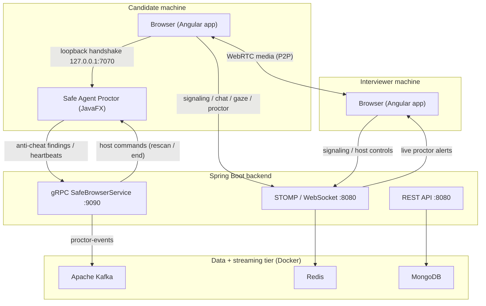

# Zoomy — A Proctored Video-Interview Platform with Native Anti-Cheat

> Secure, real-time video interviewing that defeats the new generation of
> **AI interview-cheating overlays** by pairing a browser meeting app with a
> native desktop proctoring agent.

<p align="center">
  
</p>

<p align="center">
  <b>Angular 18</b> · <b>Spring Boot 3 / Java 21</b> · <b>JavaFX 21</b> ·
  <b>WebRTC</b> · <b>gRPC</b> · <b>Apache Kafka</b> · <b>Redis</b> ·
  <b>MongoDB</b> · <b>Docker</b> · <b>MediaPipe</b>
</p>

---

## 1. Motivation

Remote technical interviews are now routinely defeated by a class of desktop
tools — **Cluely, Interview Coder, LockedIn AI, Parakeet AI, Cheetah, LeetCode
Wizard**, and others — that render answers in an overlay the candidate can see but
that is **invisible to screen sharing and recording**. They achieve this with a
handful of Win32 calls (most importantly `SetWindowDisplayAffinity` with
`WDA_EXCLUDEFROMCAPTURE`) and by hiding themselves from the taskbar and Alt-Tab.

A browser-based proctoring solution **cannot** detect these tools: the web
sandbox has no access to the operating system's window list or per-window
screen-capture flags. **Zoomy's contribution** is a *companion-agent*
architecture — the interview runs in an ordinary browser for everyone, while a
small native agent on the candidate's machine performs the OS-level inspection
that browsers cannot, and streams verifiable proof to the interviewer in real
time.

---

## 2. What's novel / what we bring to the table

1. **Companion-agent anti-cheat model.** Instead of a locked-down "safe browser",
   the meeting stays in the candidate's normal browser (so WebRTC, screen share,
   and accessibility all just work) and a separate native agent provides the
   integrity guarantee. The browser's interview gate only opens once the agent's
   gRPC session is live.
2. **Native detection of capture-excluded windows.** The agent reads
   `GetWindowDisplayAffinity` / `GetWindowLong` on every top-level window to find
   the exact mechanisms cheat tools rely on, then **surfaces** the offending
   window (restores taskbar/Alt-Tab button, drops always-on-top, strips
   click-through) and reports it as proof.
3. **Polyglot real-time fabric.** Three transport styles, each chosen for its job:
   **WebRTC** (peer media), **STOMP/WebSocket** (signaling, chat, presence, live
   proctor alerts), and **gRPC** (the desktop agent ↔ backend control channel).
4. **On-device behavioural AI.** A MediaPipe FaceLandmarker pipeline runs entirely
   in the browser (self-hosted WASM + model, no third-party CDN) to score gaze
   direction, multiple faces, and absence — with a sustained "looking away" alert.
5. **Event-streaming backbone.** Proctor signals flow through **Kafka** for
   durable, replayable analytics while **Redis** provides low-latency presence and
   API rate limiting, and **MongoDB** stores durable meeting/audit data.

---

## 3. System architecture



**Flow in one sentence:** the candidate's browser carries the meeting and streams
behavioural signals over STOMP; the native agent streams OS-level anti-cheat
findings over gRPC; the backend fuses both and pushes live alerts to the
interviewer, persisting durable data in MongoDB and event streams in Kafka.

---

## 4. Technology stack

| Layer | Technology | Why it was chosen |
|-------|-----------|-------------------|
| Web client | **Angular 18** (standalone, signals) | Modern reactive UI, fine-grained change detection. |
| Peer media | **WebRTC** (mesh + perfect negotiation) | Low-latency P2P audio/video/screen without a media server in dev. |
| Signaling | **STOMP over WebSocket (SockJS)** | Topic-based pub/sub for rooms, chat, presence, and proctor alerts. |
| Backend | **Spring Boot 3.3 / Java 21** | Mature ecosystem, first-class messaging + security. |
| Agent channel | **gRPC (bi-directional streaming)** | Strongly-typed, efficient, full-duplex control link for the desktop agent. |
| Desktop agent | **JavaFX 21 + JNA** | Cross-platform UI with direct Win32 access for native inspection. |
| Event stream | **Apache Kafka** | Durable, replayable proctor-event log for analytics. |
| Hot state | **Redis** | Presence/room state + fixed-window API rate limiting (fail-open). |
| Durable store | **MongoDB** | Meetings, auth, chat, and proctor history. |
| On-device AI | **MediaPipe FaceLandmarker** | Browser-native gaze/face analysis; no data leaves the device. |
| Packaging | **Docker Compose** + **jpackage** | One-command data tier; native `.exe` for the agent. |

---

## 5. Repository structure

```
zoomy/
├── web-application/
│   ├── backend/                 # Spring Boot REST + STOMP + gRPC server (Java 21)
│   ├── frontend/                # Angular 18 web client
│   └── infra/                   # Docker Compose: Kafka, Redis, MongoDB, Postgres
├── desktop-application/
│   └── safe-agent-proctor/      # JavaFX desktop anti-cheat agent (+ jpackage .exe)
├── setup.ps1                    # one-click setup/run (Windows)
├── setup.sh                     # one-click setup/run (macOS / Linux)
└── README.md                    # this file
```

Each component folder has its own focused `README.md`:
[backend](web-application/backend/README.md) ·
[frontend](web-application/frontend/README.md) ·
[infra](web-application/infra/README.md) ·
[safe-agent-proctor](desktop-application/safe-agent-proctor/README.md).

**Design docs** (`docs/`):
[High-Level Design](docs/HLD.md) ·
[Low-Level Design](docs/LLD.md) ·
[Protocol & Communication Flow](docs/PROTOCOL-FLOW.md) ·
[gRPC & Hosting Guide](docs/GRPC-HOSTING.md).

---

## 6. The anti-cheat technique (research detail)

Cheating overlays remain invisible to capture using documented Windows APIs. The
agent inverts each trick by *reading back* the same state from a native process:

| Evasion used by cheat tools | API that enables it | Detection signal read by the agent |
|-----------------------------|--------------------|------------------------------------|
| Excluded from screen capture | `SetWindowDisplayAffinity(hWnd, WDA_EXCLUDEFROMCAPTURE)` | `GetWindowDisplayAffinity == 0x11` / `0x1` |
| Removed from taskbar and Alt-Tab | `WS_EX_TOOLWINDOW` ex-style | `GetWindowLong(GWL_EXSTYLE)` bit set |
| Click-through always-on-top HUD | `WS_EX_LAYERED + WS_EX_TRANSPARENT + WS_EX_TOPMOST` | ex-style combination + real geometry |
| Known cheat binaries | — | executable basename / window-title blocklist + keyword match |

On a positive detection the agent performs a **best-effort reveal** —
`SetWindowLong` to strip `WS_EX_TRANSPARENT`/`WS_EX_TOOLWINDOW` and add
`WS_EX_APPWINDOW`, `SetLayeredWindowAttributes` to force opacity, `ShowWindow`
to re-register the taskbar button, and `SetWindowPos(HWND_NOTOPMOST)` to drop
always-on-top. Clearing another process's *capture affinity* is forbidden by the
OS (the window "must belong to the current process"), so that case is detected
and reported rather than forcibly cleared. Every finding is streamed to the
interviewer with the offending window title and executable path as evidence.

Browser-side behavioural signals complement this: gaze direction and "looking
away ≥ 4 s", multiple faces, and no-face detection via MediaPipe, plus tab/window
blur and paste-rate heuristics.

---

## 7. Real-time design

- **Media (WebRTC mesh).** One `RTCPeerConnection` per remote participant with
  perfect-negotiation politeness; screen share is published as its own stream so
  it appears as a separate tile for everyone.
- **Signaling (STOMP).** Room-scoped destinations: publish to
  `/app/room/{id}/{signal|media|chat|gaze|control|proctor}`, subscribe to the
  matching `/topic/room/{id}/…`. Presence is reconciled from snapshots on
  join/leave.
- **Agent control (gRPC).** `Connect` performs a JWT handshake; a bi-directional
  `Session` stream carries `AgentEvent`s up (heartbeats, proctor signals, system
  insights) and `HostCommand`s down (`rescan`, `end`). A registry tracks live,
  non-stale sessions per meeting.

---

## 8. Security

- **JWT auth** with short-lived access tokens (15 min) and rotating refresh
  tokens (7 days); the web client transparently refreshes and the agent is
  re-handshaked with a fresh token on reconnect.
- **Redis-backed rate limiting** on `/api/*` (stricter on auth endpoints), with a
  fail-open design so an outage never hard-blocks traffic.
- **OWASP-safe error handling**: a global handler returns generic messages with a
  trace id and never leaks stack traces.
- **On-device AI**: the gaze model and WASM are self-hosted; webcam frames never
  leave the candidate's browser.

---

## 9. Getting started

### Option A — one-click script (recommended)

From the repository root:

```powershell
# Windows (PowerShell)
./setup.ps1
```

```bash
# macOS / Linux
chmod +x setup.sh && ./setup.sh
```

The script checks prerequisites, starts the Docker data tier, installs frontend
dependencies, and launches the backend, frontend, and (on Windows) the desktop
agent. Pass `-SkipAgent` / `--skip-agent` to omit the desktop app, or
`-InfraOnly` / `--infra-only` to start just the databases.

### Option B — manual

```bash
# 1. Data tier
cd web-application/infra && docker compose up -d

# 2. Backend (http://localhost:8080, gRPC 9090)
cd ../backend && mvn -DskipTests spring-boot:run

# 3. Frontend (http://localhost:4200)
cd ../frontend && npm install && npm start      # use npm.cmd on Windows PowerShell

# 4. Desktop agent (candidate side)
cd ../../desktop-application/safe-agent-proctor && mvn javafx:run
```

**Prerequisites:** JDK 21, Maven 3.9+, Node.js 18/20, and Docker Desktop. See each
component README for details. On a corporate TLS proxy, set
`MAVEN_OPTS=-Djavax.net.ssl.trustStoreType=Windows-ROOT`.

---

## 10. Abstract (for a paper / report)

> *Zoomy is a web-based video-interview platform that addresses a contemporary
> integrity threat: AI assistant overlays that are deliberately excluded from
> screen capture and hidden from the operating-system shell. We propose a
> companion-agent architecture in which the interview is conducted in a standard
> browser while a co-resident native agent performs operating-system-level window
> inspection that browser sandboxes prohibit. The agent detects capture-excluded,
> taskbar-hidden, and click-through overlay windows by reading the same Win32
> attributes the evasion relies upon, attempts a non-destructive reveal, and
> streams authenticated evidence to the proctor over a bi-directional gRPC
> channel. Browser-side behavioural cues (gaze, face count, focus/paste events)
> computed on-device with MediaPipe complement the native signals. The backend
> fuses both signal sources, fans live alerts to the interviewer over WebSocket,
> and persists an event stream in Apache Kafka for post-hoc analysis, with Redis
> for presence and rate limiting and MongoDB for durable records.*

---

## 11. Roadmap

- AI meeting intelligence: live captions, post-call summaries, and interview
  scorecards via a Python/LangGraph sidecar (RabbitMQ + faster-whisper + pgvector).
- SFU media path (LiveKit/Janus) for larger rooms beyond the mesh limit.
- Cross-platform native detection (macOS/Linux equivalents of the Win32 checks).
- Signed installers (`jpackage --type exe`/`msi`/`pkg`) for the desktop agent.

---

## 12. License and credits

Built as an end-to-end demonstration of secure real-time systems engineering.
Uses open-source components: Angular, Spring Boot, gRPC, Apache Kafka, Redis,
MongoDB, JavaFX, JNA, and MediaPipe. See each component's dependencies for their
respective licenses.
