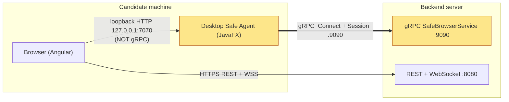
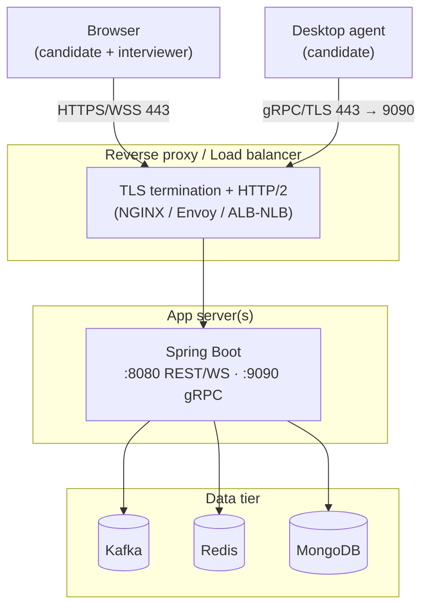

# Zoomy — gRPC & Hosting Guide

> **Your question:** *"If I host this application, will my gRPC still work? What
> do I have to do for gRPC, and where is it working in the application?"*
>
> **Short answer:** Yes — gRPC keeps working when you host Zoomy, but it does
> **not** work unchanged. The desktop agent currently points at `localhost:9090`
> in **plaintext**. To host, you must (1) point the agent at your **public**
> server, (2) turn on **TLS**, and (3) open the gRPC port through your
> firewall / load balancer with **HTTP/2** enabled. Details below.

---

## 1. Where gRPC is used in the application

gRPC is used in **exactly one place**: the channel between the **desktop Safe
Agent** (candidate's machine) and the **backend**. The browser does **not** use
gRPC — it stays on REST + WebSocket.



**The gRPC leg is the thick highlighted arrow** (`agent → :9090`). Concretely:

| Side | File | What it does |
|------|------|--------------|
| Server | `web-application/backend/.../grpc/SafeBrowserGrpcService.java` | `@GrpcService` implementing `Connect` + `Session`. |
| Server | `web-application/backend/.../grpc/SafeAgentRegistry.java` | Tracks live agent sessions. |
| Server config | `web-application/backend/src/main/resources/application.yml` | `grpc.server.port: ${ZOOMY_GRPC_PORT:9090}` |
| Server dep | `web-application/backend/pom.xml` | `net.devh:grpc-server-spring-boot-starter` (grpc 1.63.0). |
| Client | `desktop-application/safe-agent-proctor/.../AgentClient.java` | Builds the channel & streams. |
| Client config | `desktop-application/safe-agent-proctor/.../SafeAgentApp.java` | Reads `-Dzoomy.grpcHost` / `-Dzoomy.grpcPort`. |
| Contract | `**/src/main/proto/safebrowser.proto` (one copy each side) | Service + message definitions. |

> The `127.0.0.1:7070` link (browser → agent) is **plain loopback HTTP, not
> gRPC**, and it is always on the same machine — hosting never affects it.

---

## 2. Why it won't "just work" when hosted (the 3 blockers)

### Blocker 1 — the agent points at `localhost`

`SafeAgentApp.java`:

```java
private final String grpcHost = System.getProperty("zoomy.grpcHost", "localhost");
private final int    grpcPort = Integer.getInteger("zoomy.grpcPort", 9090);
```

On a candidate's laptop, `localhost:9090` means *their own machine* — there is no
backend there. It must point at your **public server address**.

### Blocker 2 — the channel is plaintext (no TLS)

`AgentClient.java`:

```java
channel = NettyChannelBuilder.forAddress(grpcHost, grpcPort)
    .usePlaintext()        // ← fine on localhost, UNSAFE over the internet
    .build();
```

`usePlaintext()` sends the JWT and all telemetry unencrypted. Over the internet
you must use TLS on both ends.

### Blocker 3 — the network path must allow gRPC (HTTP/2)

gRPC runs over **HTTP/2**. The port must be reachable and any proxy/load balancer
in front must support HTTP/2 end-to-end (many default HTTP/1.1 proxies silently
break gRPC).

---

## 3. What to do — hosting checklist

### Step A — Make the server address configurable per environment

You already have the knobs (`-Dzoomy.grpcHost`, `-Dzoomy.grpcPort`). For a
hosted build, bake in the production host (or fetch it from the handshake — see
Step D). Example launch:

```powershell
java -Dzoomy.api=https://api.zoomy.example.com `
     -Dzoomy.grpcHost=api.zoomy.example.com `
     -Dzoomy.grpcPort=443 `
     -jar zoomy-safe-agent.jar
```

### Step B — Turn on TLS

**Server** — terminate TLS at a reverse proxy (recommended) **or** in Spring:

```yaml
# application.yml — in-process TLS (net.devh starter)
grpc:
  server:
    port: 9090
    security:
      enabled: true
      certificate-chain: file:/etc/zoomy/tls/fullchain.pem
      private-key:       file:/etc/zoomy/tls/privkey.pem
```

**Agent** — switch the channel from plaintext to TLS:

```java
// AgentClient.java
channel = NettyChannelBuilder.forAddress(grpcHost, grpcPort)
    .useTransportSecurity()         // ← was .usePlaintext()
    .build();
```

If you use a public CA cert (e.g. Let's Encrypt) on the server, the agent needs
no extra trust config — the JDK trusts it automatically.

### Step C — Open the network path

| Where | What to allow |
|-------|---------------|
| Server firewall / cloud security group | inbound TCP on the gRPC port (9090, or 443 if proxied). |
| Load balancer / reverse proxy | **HTTP/2** passthrough or native gRPC support. NGINX: `grpc_pass grpcs://backend;`. AWS: use an **NLB**, or an **ALB** with a gRPC target group. |
| TLS | terminate at the proxy, re-encrypt or h2c to the backend. |

### Step D — (Recommended) deliver the address via the handshake

The browser already hands the agent the session over loopback. Extend that
handshake (`POST /handshake`) to also pass the API/gRPC base URL the SPA is
configured with, so the agent never hard-codes an environment. This makes one
agent build work across dev/staging/prod.

### Step E — Keep gRPC versions consistent

Don't cross-pin gRPC libraries. Backend = grpc 1.63.0 (matches the Spring starter
3.1.0); the standalone agent = 1.66.0. Mixing grpc-core and grpc-netty-shaded
versions throws `NoClassDefFoundError io.grpc.InternalConfiguratorRegistry`.

---

## 4. Recommended hosted topology



> **Sticky sessions:** both WebSocket (STOMP) and the gRPC `Session` stream are
> long-lived. If you run more than one backend instance behind a load balancer,
> enable connection stickiness (or route gRPC to a dedicated target group) so a
> stream stays pinned to the instance that owns it. The in-memory
> `SafeAgentRegistry` is per-instance — for true horizontal scale, move it to
> Redis (a documented future step).

---

## 5. Will gRPC work if hosted? — decision table

| Scenario | Works? | Why |
|----------|--------|-----|
| Everything on one box (current dev) | ✅ | agent → `localhost:9090` plaintext is fine. |
| Hosted, agent still pointing at `localhost` | ❌ | `localhost` is the candidate's own laptop. Set `zoomy.grpcHost`. |
| Hosted, public host, **plaintext** | ⚠️ Works but **insecure** & many proxies block it | use TLS. |
| Hosted, public host, **TLS**, port open, HTTP/2 proxy | ✅ **Recommended** | this is the target setup. |
| Hosted behind an HTTP/1.1-only proxy | ❌ | gRPC needs HTTP/2 end-to-end. |

**Bottom line:** gRPC is fully host-able. The code already externalizes host/port;
you only need to (1) set the production host, (2) flip `usePlaintext()` →
`useTransportSecurity()` and add a server cert, and (3) make sure the port is open
through an HTTP/2-capable proxy.
