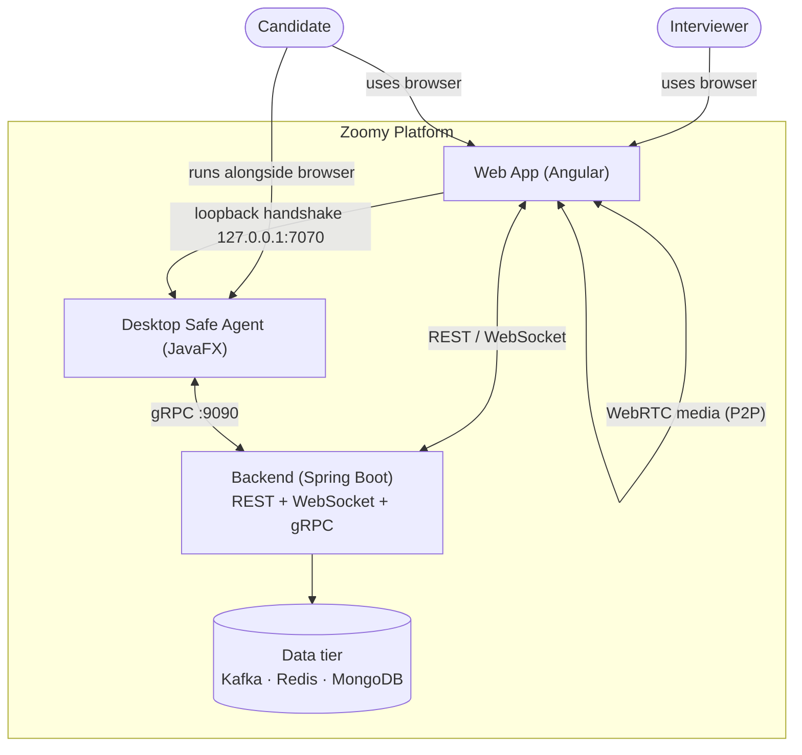
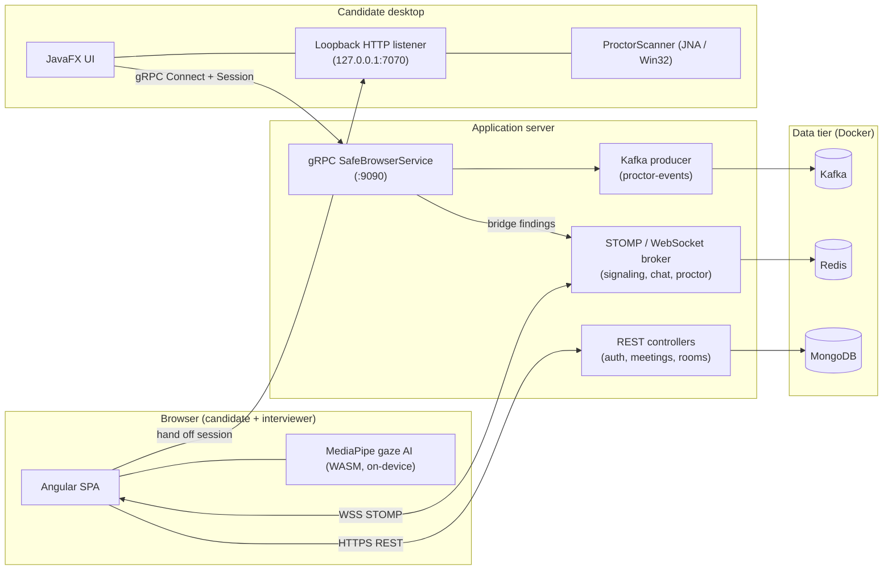
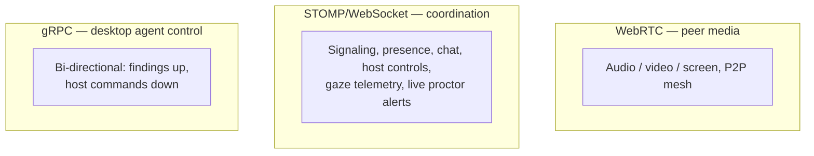
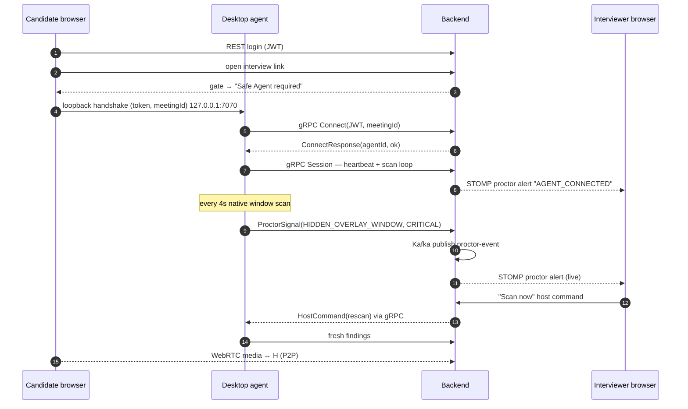
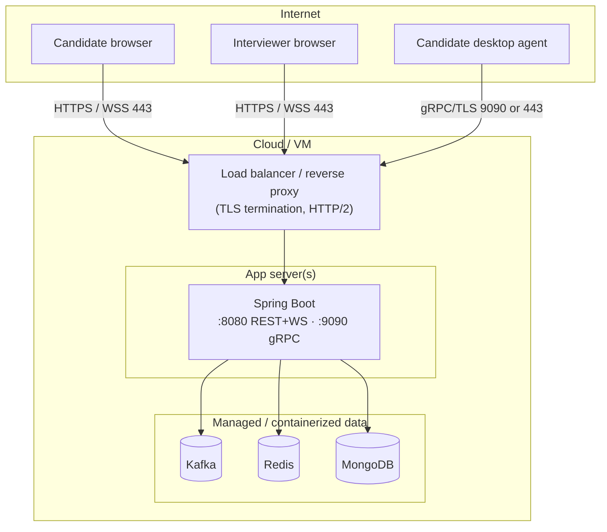

# Zoomy — High-Level Design (HLD)

> Architecture-level view of the Zoomy proctored video-interview platform.
> For class/method-level detail see [LLD.md](LLD.md). For the gRPC hosting
> question see [GRPC-HOSTING.md](GRPC-HOSTING.md).

---

## 1. Purpose & scope

Zoomy is a real-time video-interview platform whose distinguishing feature is a
**native anti-cheat companion agent**. The interview runs in an ordinary browser
for both parties, while a small desktop agent on the candidate's machine performs
operating-system-level cheat detection that browsers cannot, and streams proof to
the interviewer in real time.

The system has **three deployable units** plus a shared **data tier**:

| Unit | Tech | Runs where |
|------|------|-----------|
| Frontend (web client) | Angular 18 | Candidate & interviewer browsers |
| Backend (API + gRPC server) | Spring Boot 3 / Java 21 | Server (cloud/VM) |
| Desktop agent | JavaFX 21 + JNA | Candidate's Windows machine |
| Data tier | Kafka, Redis, MongoDB | Server (Docker) |

---

## 2. C4 Level-1 — System context

---

## 3. C4 Level-2 — Container view

---

## 4. Three transport styles (and why)

Zoomy intentionally uses three real-time transports, each chosen for its job.

| Transport | Carries | Why this and not the others |
|-----------|---------|------------------------------|
| **WebRTC** | Audio/video/screen | Lowest-latency P2P media; no server in the media path for small rooms. |
| **STOMP/WebSocket** | Signaling, chat, presence, proctor alerts | Topic pub/sub fits room broadcast; the browser speaks it natively. |
| **gRPC** | Desktop agent ↔ backend | Strongly-typed, efficient, full-duplex streaming for a long-lived native client. A browser cannot speak native gRPC, which is fine — only the desktop agent uses it. |

---

## 5. Key end-to-end flow — interview with proctoring

---

## 6. Quality attributes

| Attribute | How it's met |
|-----------|--------------|
| **Real-time** | WebRTC for media; STOMP fan-out for alerts; gRPC streaming for the agent. |
| **Security** | JWT (15-min access + 7-day refresh), Redis rate limiting (fail-open), OWASP-safe error bodies, on-device AI (no webcam frames leave the browser). |
| **Resilience** | Agent auto-reconnect with token refresh; STOMP session-disconnect → auto-leave; Kafka decouples ingestion from fan-out. |
| **Scalability path** | Mesh→SFU for big rooms; Redis for presence; Kafka for durable event stream; stateless backend behind a load balancer (sticky for WS/gRPC). |
| **Portability** | Data tier in Docker Compose; agent packaged as a native `.exe` via jpackage. |

---

## 7. Deployment topology (hosted)

> The candidate's browser→agent link stays on `127.0.0.1:7070` (same machine), so
> it is unaffected by hosting. Only the **agent→backend gRPC** leg crosses the
> internet — see [GRPC-HOSTING.md](GRPC-HOSTING.md).
