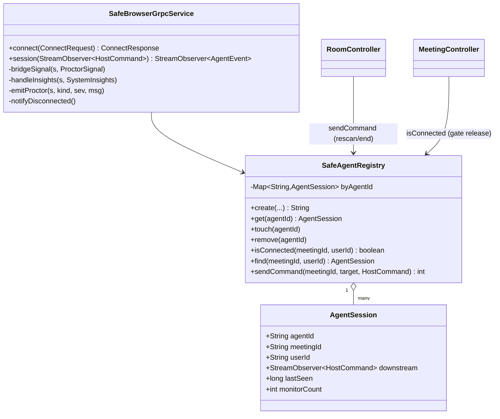
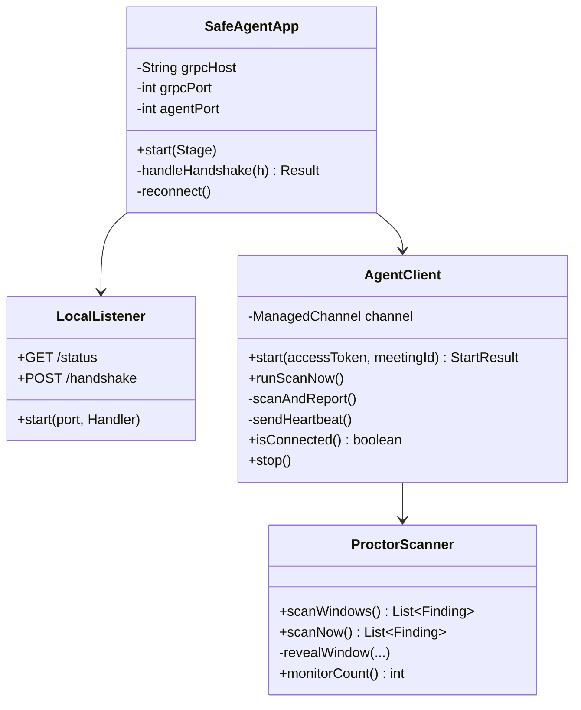
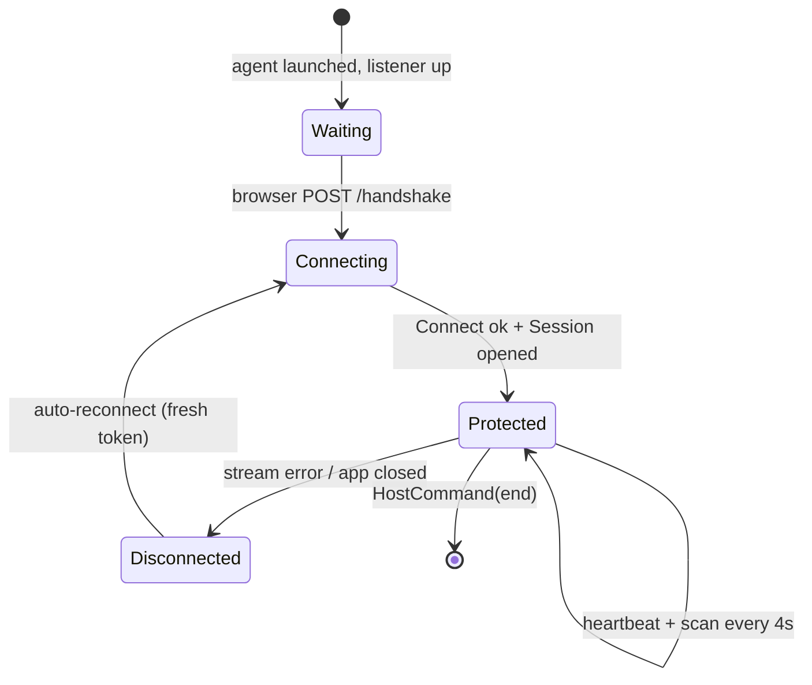
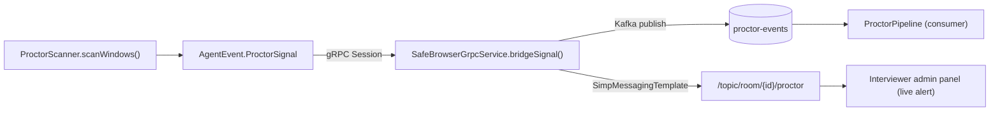

# Zoomy — Low-Level Design (LLD)

> Component, class, and protocol-level detail. For the big picture see
> [HLD.md](HLD.md). For gRPC hosting see [GRPC-HOSTING.md](GRPC-HOSTING.md).

---

## 1. Backend module map (`web-application/backend`)

```
com.zoomy.api
├── auth/            JWT auth, login/refresh, user store
├── meeting/         MeetingController · MeetingService · Meeting (Mongo)
├── room/            RoomController (STOMP) · chat store · room events
├── signaling/       SignalingController (WebRTC offer/answer/ICE relay)
├── proctor/         ProctorPipeline (Kafka consumer → fan-out)
├── events/          ProctorEvent (Kafka payload)
├── grpc/            SafeBrowserGrpcService · SafeAgentRegistry   ← gRPC lives here
├── common/          GlobalExceptionHandler · ratelimit/* · Mongo config
└── config/          WebConfig (CORS/security) · KafkaTopicsConfig
```

### 1.1 gRPC server classes (the anti-cheat channel)

| Class | Responsibility |
|-------|----------------|
| `SafeBrowserGrpcService` | `@GrpcService` implementing `SafeBrowserServiceGrpc`. Handles `Connect` (JWT handshake) and `Session` (bi-directional stream). Bridges agent findings onto STOMP `/topic/room/{id}/proctor` and emits Kafka events. |
| `SafeAgentRegistry` | `@Component`, in-memory `ConcurrentHashMap<agentId, AgentSession>`. Tracks the live downstream observer, `lastSeen`, monitor count; provides `isConnected/find/sendCommand`; expires sessions after `STALE_MS`. |
| `AgentSession` (inner) | Per-agent state: `meetingId`, `userId`, `displayName`, `participantId`, `downstream` (the `StreamObserver<HostCommand>`), `lastSeen`, `monitorCount`. |



---

## 2. Desktop agent module map (`desktop-application/safe-agent-proctor`)

```
com.zoomy.agent
├── SafeAgentApp      JavaFX UI + lifecycle; reads -Dzoomy.* config
├── LocalListener     loopback HTTP server 127.0.0.1:7070 (browser handshake)
├── AgentClient       gRPC client: Connect + Session, heartbeat + scan loop
└── ProctorScanner    JNA / Win32 native window + process inspection
```

| Class | Responsibility |
|-------|----------------|
| `SafeAgentApp` | Builds the JavaFX window; resolves `zoomy.api` / `zoomy.grpcHost` / `zoomy.grpcPort` / `zoomy.agentPort` from system properties; starts the listener; drives status pill. |
| `LocalListener` | `com.sun.net.httpserver` on `127.0.0.1:7070`. `GET /status → {running, connected, version}`; `POST /handshake {accessToken, meetingId, name}` → starts the gRPC client. CORS `*`. |
| `AgentClient` | Builds the gRPC channel (`NettyChannelBuilder.forAddress(host, port).usePlaintext()`), calls `Connect`, opens the `Session` stream, runs a 4 s scan loop + heartbeat, handles `HostCommand` (`rescan`, `end`). Auto-reconnect with a fresh token. |
| `ProctorScanner` | `EnumWindows` + `GetWindowDisplayAffinity` / `GetWindowLong` (overlay detection) + reveal (`SetWindowLong`, `ShowWindow`, `SetWindowPos`). Returns `Finding(kind, severity, message)`. |



---

## 3. gRPC contract (`safebrowser.proto`)

```protobuf
service SafeBrowserService {
  rpc Connect(ConnectRequest) returns (ConnectResponse);          // unary handshake
  rpc Session(stream AgentEvent) returns (stream HostCommand);    // bi-directional
}
```

| Message | Direction | Notes |
|---------|-----------|-------|
| `ConnectRequest` | agent → server | `access_token` (JWT), `meeting_id`, `participant_id`, `ClientInfo`. |
| `ConnectResponse` | server → agent | `agent_id` (used on every event), `ok`, `display_name`, `heartbeat_seconds`. |
| `AgentEvent` (oneof) | agent → server | `Heartbeat` \| `ProctorSignal` (kind/severity/message) \| `SystemInsights` (monitor count, processes). |
| `HostCommand` | server → agent | `kind` (`rescan` \| `end` \| `warn` \| `lockdown`), `value`, `text`. |

> **Version note:** the proto is duplicated in the backend
> (`web-application/backend/src/main/proto`) and the agent
> (`desktop-application/safe-agent-proctor/src/main/proto`). Keep them identical.

---

## 4. Session lifecycle (state machine)



- **Protected** ⇒ backend `isConnected(meetingId,userId)` is true ⇒ the browser
  interview gate releases.
- **Disconnected** ⇒ backend emits `AGENT_DISCONNECTED` on STOMP; candidate sees a
  reconnect banner; interviewer's admin panel turns red.
- Sessions older than `STALE_MS` without a heartbeat are pruned from the registry.

---

## 5. Proctor-signal data path (ingest → fan-out)



Browser-origin signals (gaze, multi-face, no-face) take the same STOMP topic via
`RoomController` `/app/room/{id}/proctor`, so the interviewer sees a single merged
alert feed regardless of source (`source = BROWSER | SAFE_BROWSER`).

---

## 6. Configuration surface

### Backend (`application.yml`, all env-overridable)

| Key | Default | Purpose |
|-----|---------|---------|
| `grpc.server.port` (`ZOOMY_GRPC_PORT`) | `9090` | gRPC listen port. |
| `MONGO_URI` | `mongodb://localhost:27017` | Mongo. |
| `REDIS_HOST/PORT` | `localhost`/`6379` | Redis. |
| `KAFKA_BOOTSTRAP` | `localhost:9092` | Kafka. |
| `JWT_SECRET` | dev value | HS256 signing key (≥32 bytes in prod). |

### Desktop agent (`-D` system properties)

| Property | Default | Purpose |
|----------|---------|---------|
| `zoomy.api` | `http://localhost:8080` | REST base. |
| `zoomy.grpcHost` | `localhost` | **gRPC server host — must change when hosted.** |
| `zoomy.grpcPort` | `9090` | gRPC server port. |
| `zoomy.agentPort` | `7070` | Loopback listener (stays local). |

---

## 7. Error handling & resilience details

- **Token expiry on reconnect:** agent's 15-min JWT expires; the web client mints
  a fresh token via the refresh token before re-handshaking, and the agent
  watchdog auto-heals (silent reconnect, 15 s cooldown).
- **Stream failures:** `onError`/`onCompleted` emit `AGENT_DISCONNECTED` and
  remove the registry entry before the interviewer is notified.
- **Rate limiting:** `RedisRateLimiter` fixed-window on `/api/*`, fail-open if
  Redis is down so an outage never hard-blocks traffic.
- **gRPC version pinning:** backend uses grpc 1.63.0 (matches
  `grpc-server-spring-boot-starter` 3.1.0); the standalone agent uses 1.66.0.
  Do not cross-pin — mismatched grpc-core vs netty-shaded throws
  `NoClassDefFoundError`.
