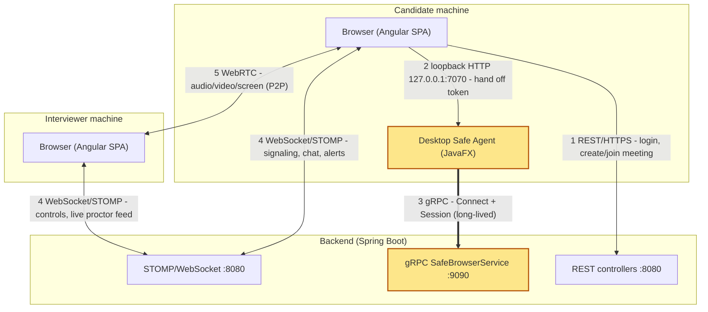
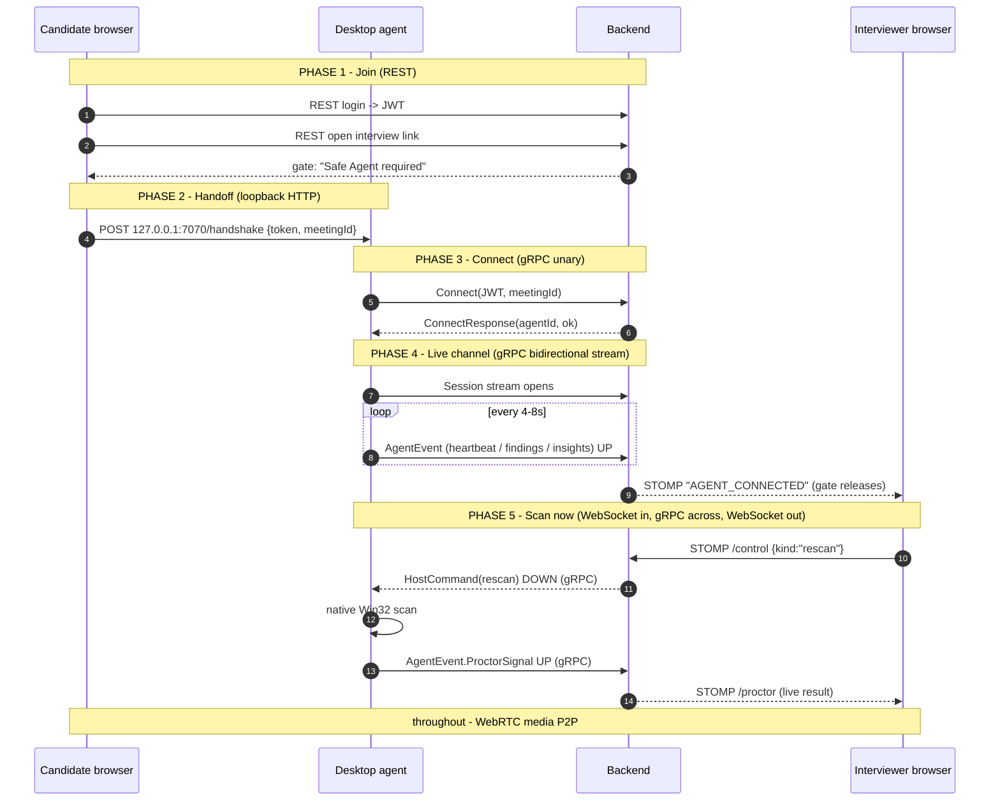
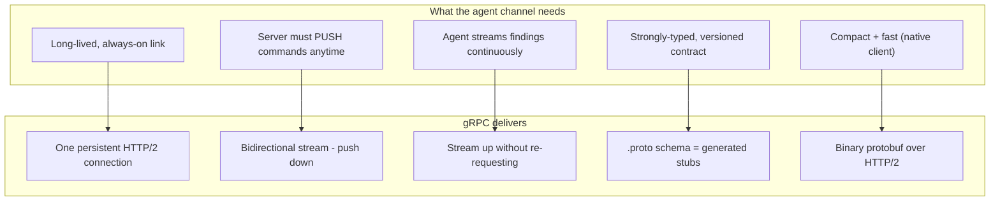
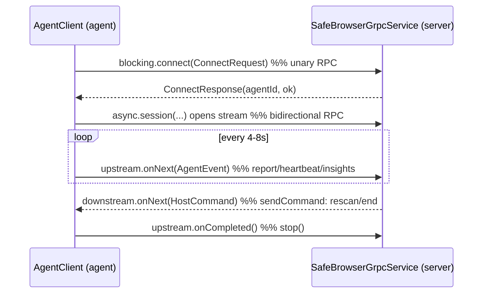

# Zoomy — Protocol & Communication Flow

> How the candidate connects through the Safe Agent proctor, and exactly **where
> REST, WebSocket, and gRPC** each do their job — plus **why gRPC** is used and
> the benefit it brings.
>
> Companion to [HLD.md](HLD.md), [LLD.md](LLD.md), and
> [GRPC-HOSTING.md](GRPC-HOSTING.md).

---

## TL;DR

**gRPC is what reaches the desktop client to execute the anti-cheat and bring the
result back.** The *first hop* (browser click) and the *last hop* (showing the
result) travel over **WebSocket**, because the browser itself isn't a gRPC client.
gRPC carries the two middle legs: **command down** and **findings up**.

| Leg | Protocol |
|-----|----------|
| Browser ⇄ backend — auth, meetings | **REST / HTTPS** |
| Browser → local agent — session handoff | **Loopback HTTP** (127.0.0.1:7070) |
| Agent ⇄ backend — anti-cheat control + telemetry | **gRPC** ✅ |
| Browser ⇄ backend — signaling, chat, alerts, controls | **WebSocket / STOMP** |
| Browser ⇄ browser — audio/video/screen | **WebRTC** |

---

## 1. Protocol map — who speaks what



| # | Leg | Protocol | Purpose |
|---|-----|----------|---------|
| 1 | Browser to backend | **REST/HTTPS** | Auth, meeting create/resolve/join. |
| 2 | Browser to agent | **Loopback HTTP** | Browser hands the JWT + meetingId to the local agent (same machine). |
| 3 | Agent to backend | **gRPC** | The anti-cheat control + telemetry channel. |
| 4 | Browser to backend | **WebSocket/STOMP** | Signaling, chat, presence, host controls, live proctor alerts. |
| 5 | Browser to browser | **WebRTC** | Peer media (no server in the path). |

---

## 2. Full connect to proctor sequence (protocol on every hop)



---

## 3. Function-level diagram - "Scan environment" round trip

The exact functions invoked, each hop labeled by protocol. The **highlighted**
boxes are the gRPC hops.

```mermaid
flowchart LR
    subgraph Browser["Interviewer browser"]
        click["Scan now button"]
    end
    subgraph Backend["Backend"]
        rc["RoomController.control()"]
        reg["SafeAgentRegistry.sendCommand()"]
        svc["SafeBrowserGrpcService.session().onNext()"]
        bridge["bridgeSignal() -> emitProctor()"]
    end
    subgraph Agent["Desktop agent"]
        sess["AgentClient.session().onNext(HostCommand)"]
        scan["runScanNow() -> ProctorScanner.scanNow()"]
        rep["report() -> upstream.onNext()"]
    end

    click -->|"WebSocket/STOMP"| rc
    rc -->|"in-process"| reg
    reg -->|"gRPC DOWN downstream.onNext()"| sess
    sess -->|"native Win32 (JNA)"| scan
    scan --> rep
    rep -->|"gRPC UP upstream.onNext()"| svc
    svc --> bridge
    bridge -->|"WebSocket/STOMP"| click

    style reg fill:#fde68a,stroke:#b45309
    style sess fill:#fde68a,stroke:#b45309
    style rep fill:#fde68a,stroke:#b45309
    style svc fill:#fde68a,stroke:#b45309
```

### The exact functions in that chain

| Step | Function | Protocol | File |
|------|----------|----------|------|
| 1 | `RoomController.control()` | receives STOMP click, maps `"rescan"` | `web-application/backend/.../room/RoomController.java` |
| 2 | `SafeAgentRegistry.sendCommand()` | `down.onNext(cmd)` pushes **down** the gRPC stream | `web-application/backend/.../grpc/SafeAgentRegistry.java` |
| 3 | `AgentClient.session().onNext(HostCommand)` | `case "rescan" -> runScanNow()` | `desktop-application/safe-agent-proctor/.../AgentClient.java` |
| 4 | `AgentClient.runScanNow()` -> `ProctorScanner.scanNow()` | native Win32 scan | `desktop-application/safe-agent-proctor/.../ProctorScanner.java` |
| 5 | `report()` -> `upstream.onNext(...)` | streams findings **up** the gRPC stream | `desktop-application/safe-agent-proctor/.../AgentClient.java` |
| 6 | `SafeBrowserGrpcService.bridgeSignal()` -> `emitProctor()` | STOMP to the interviewer | `web-application/backend/.../grpc/SafeBrowserGrpcService.java` |

> STOMP carries only the first (click) and last (display) leg because the browser
> can't speak native gRPC. gRPC carries the two middle legs: **command down** and
> **findings up**.

---

## 4. Why gRPC here - the benefit



| Benefit | What it buys Zoomy | If we used REST polling instead |
|---------|--------------------|--------------------------------|
| **Bidirectional streaming** | Backend pushes `rescan`/`end` to the agent **instantly**; agent streams findings **as they happen**. | Agent would have to poll every few seconds -> latency + wasted calls. |
| **One persistent HTTP/2 connection** | Low overhead, multiplexed, keep-alive heartbeats double as liveness. | New TCP/TLS handshake per REST call. |
| **Strong typing via `.proto`** | `ConnectRequest`, `AgentEvent`, `HostCommand` generated on both sides - no manual JSON, no drift. | Hand-written DTOs, easy to mismatch. |
| **Compact binary (protobuf)** | Smaller, faster payloads for frequent telemetry. | Verbose JSON. |
| **Built-in stream lifecycle** | `onError`/`onCompleted` instantly signal "agent dropped" -> interviewer notified. | Need a separate timeout/heartbeat scheme. |

**Bottom line:** gRPC is the right tool precisely because this is a *native,
long-lived, push-capable, high-frequency* link - something the browser legs (REST
for request/response, WebSocket for room broadcast, WebRTC for media) each handle
for their own job, while gRPC handles the one channel a browser can't: the desktop
anti-cheat agent.

---

## 5. The two gRPC RPCs (the whole contract)

```protobuf
service SafeBrowserService {
  rpc Connect(ConnectRequest) returns (ConnectResponse);          // unary handshake
  rpc Session(stream AgentEvent) returns (stream HostCommand);    // bidirectional stream
}
```



- **Up (agent -> server):** `Heartbeat`, `ProctorSignal` (findings), `SystemInsights`.
- **Down (server -> agent):** `HostCommand` (`rescan`, `end`, `lockdown`, `warn`).
